# README

 ## 介绍

 本项目的主要目标是设计并实现一个结合PBL(项目式学习)理念的小组协作云平台系统。

​        基于MVC架构（Model-View-Controller），本系统采用分层架构设计，从前端到后端逐级解耦，确保功能模块的高内聚、低耦合。本项目聚焦于前端系统的实现，服务层仅设计轻量化脚本与腾讯云对象数据库进行数据交互。前端UI层基于React18框架，结合Ant Design和Material UI组件库构建用户界面，通过TypeScript实现类型安全检查，并利用SCSS实现复杂组件样式。展示层负责页面渲染、用户交互响应以及数据可视化展示，通过发起HTTP请求与业务层进行数据交互。业务逻辑层使用TypeScript编写业务规则实现了项目管理、文件共享、在线交流等业务功能，在接收到前端请求后调用数据层接口处理业务逻辑，最后返回操作结果至前端。数据层主要负责数据存储和数据管理的职责，使用本地JSON文件作为Mock数据，模拟真实数据场景在开发阶段进行快速原型验证，使用腾讯云COS数据库存储用户项目文件，通过SDK实现文件增删改查操作。

​        该平台基础功能可分为九大模块：登录注册模块、项目中心模块、项目组创建模块、个人项目与项目组模块、项目组进度可视化模块、项目详情模块、在线交流协作模块、个人中心模块、收件箱模块。基于不同能力，九大主模块将在功能维度深入细化成若干子模块，实现平台项目管理、任务分配与跟踪、文件共享、在线交流、项目组管理、用户间消息通信等功能。

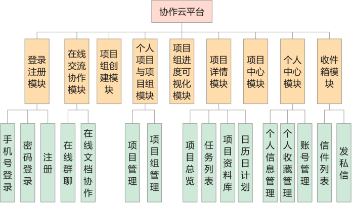

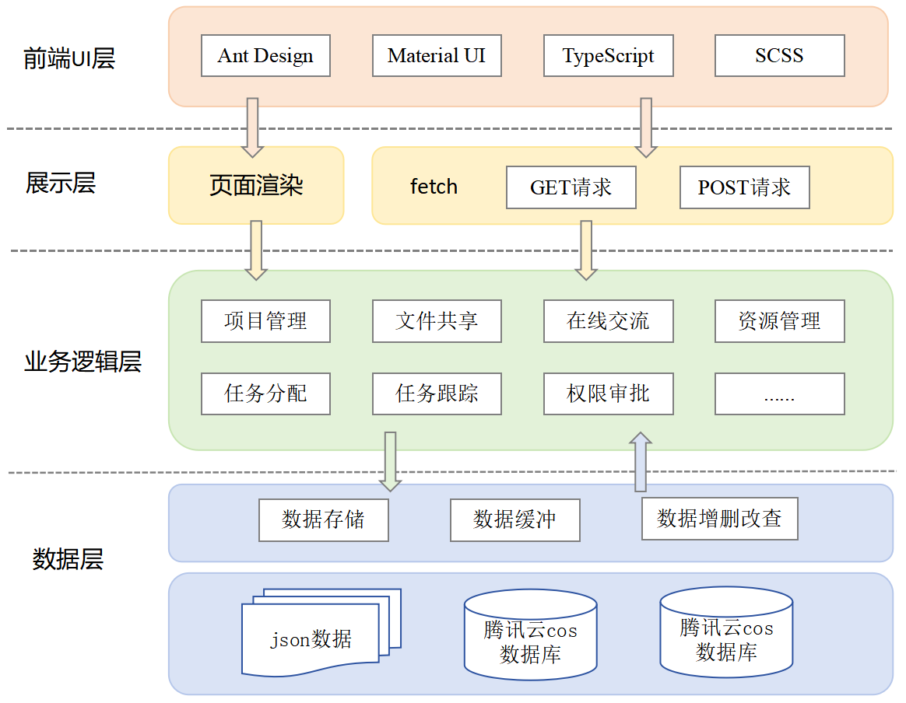

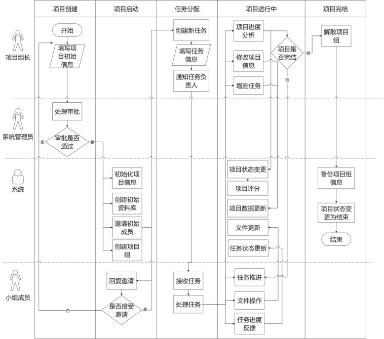

## 部分界面展示

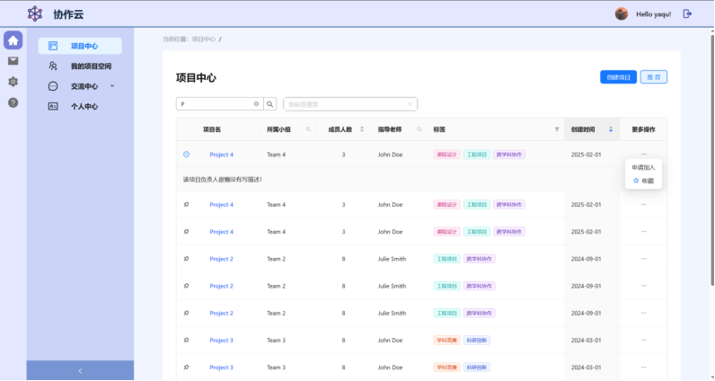

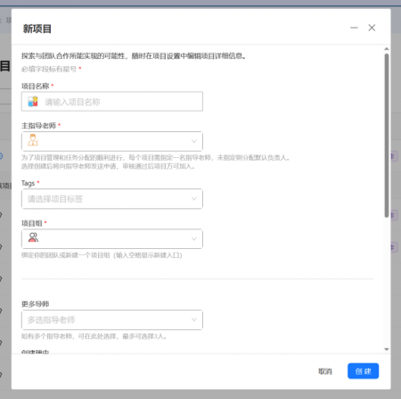

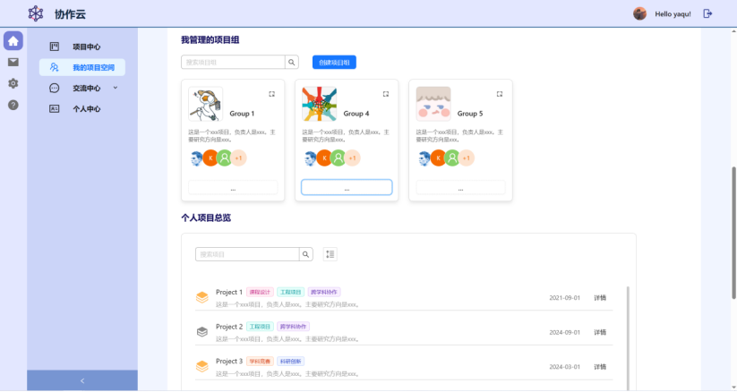

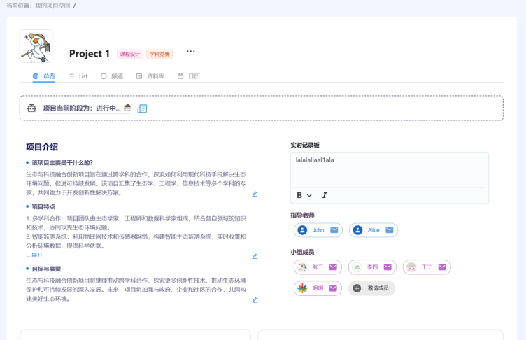

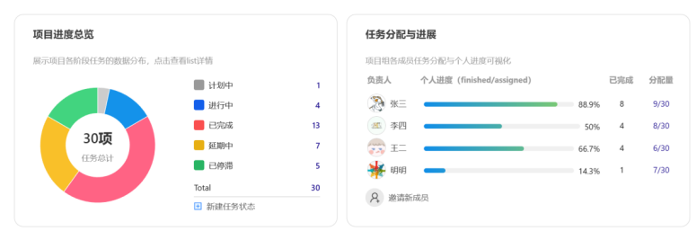

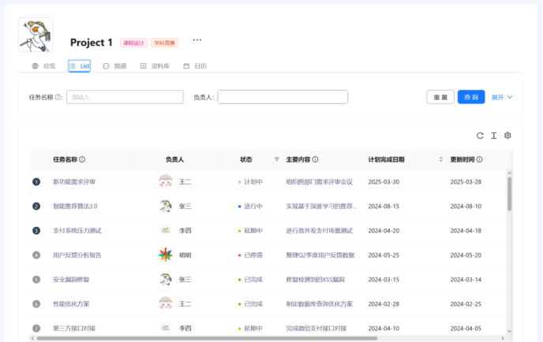

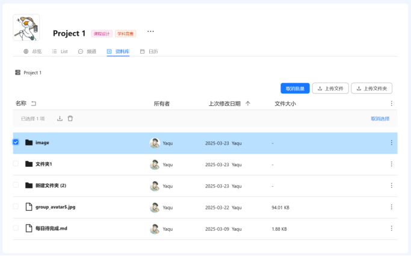

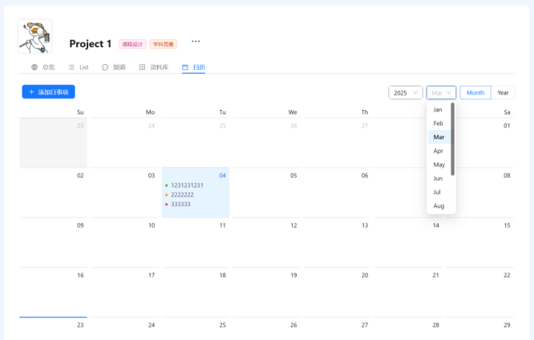

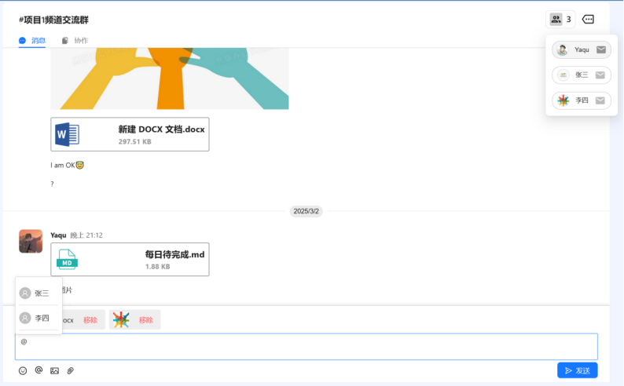

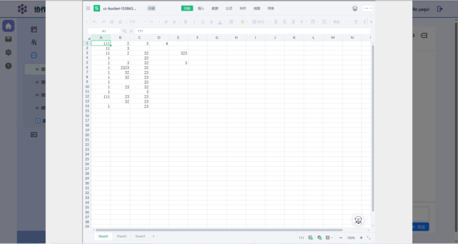

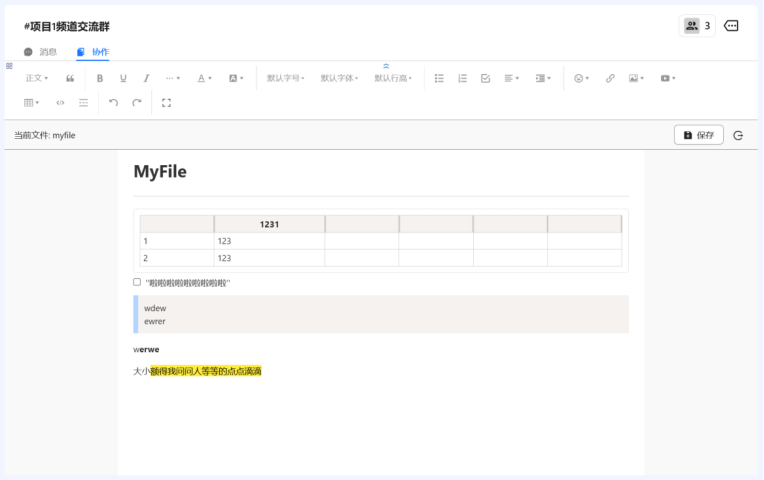

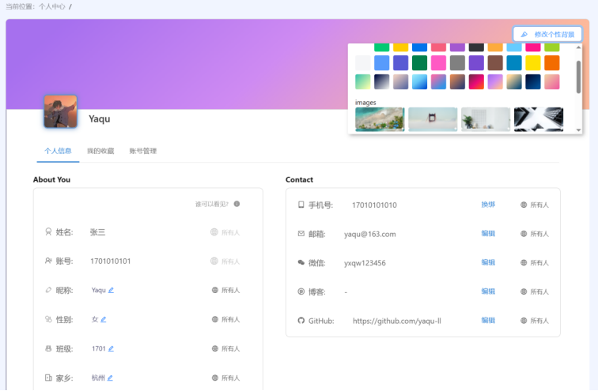

